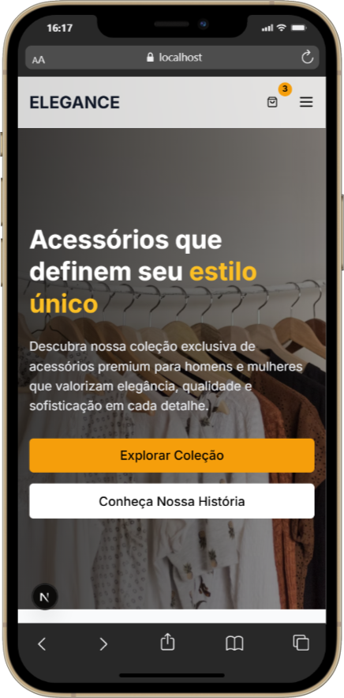
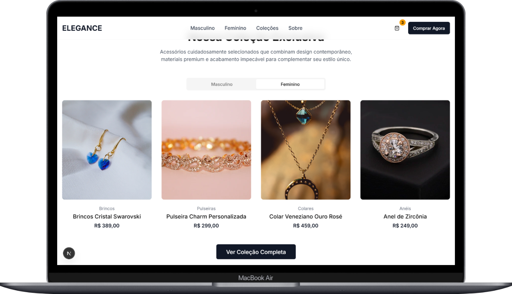
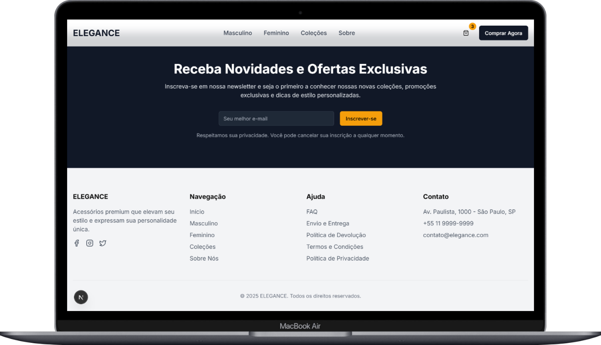

# ELEGANCE — Landing Page de Acessórios Premium

Projeto de landing page construída com Next.js 15, React 19, TypeScript e Tailwind CSS. Inclui vitrine com tabs, prova social, newsletter e carrinho lateral animado com framer-motion.

## Sumário
- Visão Geral
- Demonstrações do Layout
- Stack e Decisões
- Estrutura de Pastas
- Scripts
- Como Rodar Localmente
- Componentes e Recursos
- Carrinho — UX e Comportamento
- Toast/Notificações
- Tema e Tipografia
- Imagens e Otimização
- Acessibilidade
- Boas Práticas de Contribuição
- Roadmap / Ideias Futuras

## Visão Geral
A ELEGANCE apresenta uma coleção de acessórios masculinos e femininos, com seções de destaque, vitrine por categorias, depoimentos, newsletter e um carrinho lateral moderno que dá feedback imediato ao adicionar itens.

## Demonstrações do Layout

- Hero Desktop/Mobile

<table>
  <tr>
    <td align="center"></td>
    <td align="center"></td>
  </tr>
</table>

- Vitrine de Produtos (Masculino/Feminino)

<table>
  <tr>
    <td align="center"></td>
    <td align="center"></td>
  </tr>
</table>

- Carrinho Lateral Aberto

<p align="center">
  
</p>

- Depoimentos

<p align="center">
  
</p>

- Newsletter / Footer

<p align="center">
  
</p>

## Stack e Decisões
- Next.js 15 (App Router) + React 19 + TypeScript
- Tailwind CSS + tailwindcss-animate
- Radix UI Components (via componentes em `components/ui`)
- framer-motion (animações do carrinho)
- Context API para estado do carrinho (`context/cart-context.tsx`)
- Notificações simples via `window.showToast` (`components/ui/toast-notification.tsx`)

Motivações:
- App Router melhora composição de layout e SEO
- Tailwind agiliza iteração visual e consistência
- framer-motion fornece transições suaves para a barra lateral

## Estrutura de Pastas
```
app/
  layout.tsx       # Layout raiz e provedores
  page.tsx         # Landing principal
  globals.css      # Tokens e camadas Tailwind
components/
  header.tsx, hero-section.tsx, product-showcase.tsx, ...
  cart.tsx         # Painel lateral do carrinho
  ui/*             # Design system / wrappers Radix
context/
  cart-context.tsx # Estado global do carrinho
hooks/
  use-toast.ts, use-mobile.tsx
lib/
  utils.ts         # utilitários (cn, formatPrice)
public/
  ...              # assets estáticos
```

## Scripts
- `pnpm dev` — ambiente de desenvolvimento
- `pnpm build` — build de produção
- `pnpm start` — inicia servidor de produção local

## Como Rodar Localmente
1. Requisitos: Node 20+ e PNPM
2. Instale dependências:
   ```bash
   pnpm install
   ```
3. Execute em desenvolvimento:
   ```bash
   pnpm dev
   ```
4. Acesse `http://localhost:3000`

## Componentes e Recursos
- `Header` com navegação responsiva e botão do carrinho
- `HeroSection` com CTAs
- `ProductShowcase` com tabs Masculino/Feminino e ações (Adicionar, Favoritar)
- `Cart` com cupom, frete, salvos para depois, recomendados
- `SocialProof`, `Testimonials`, `Newsletter`, `Footer`

## Carrinho — UX e Comportamento
- Abre automaticamente ao adicionar itens
- Faz scroll e destaca o item recém-adicionado
- Badge animado com total de itens
- Cupom de desconto (ex.: `ELEGANCE10`), frete (padrão/expresso/grátis)
- Persistência em `localStorage` e limpeza automática quando vazio

## Toast/Notificações
- `ToastContainer` registra `window.showToast(message, type)`
- Tipos: `success | error | info`

## Tema e Tipografia
- Fonte `Inter` via `next/font/google` aplicada no `layout.tsx`
- Tokens CSS (cores, raio, etc.) em `app/globals.css`
- `ThemeProvider` opcional em `components/theme-provider.tsx`

## Imagens e Otimização
- `next/image` com `images.unoptimized: true` (dispensa configuração de domínios)
- Imagens exemplo do Unsplash; você pode trocar por arquivos em `public/`
- Para URLs estáveis, prefira `images.unsplash.com/photo-...` com `?auto=format&fit=crop&w=...&q=...`

## Acessibilidade
- Ícones com `sr-only` quando necessário
- Foco visível e contraste adequados
- Sugestões futuras: `aria-expanded`/`aria-controls` no menu mobile; foco gerenciado no carrinho

## Boas Práticas de Contribuição
- Commits descritivos
- Evitar `any`; priorizar componentes desacoplados e utilitários
- Seguir formatação do projeto

## Roadmap / Ideias Futuras
- Integração real de checkout (Stripe / Mercado Pago)
- Toggle de tema com `next-themes`
- Otimização de imagens com `remotePatterns`
- Internacionalização (pt-BR/en) com `next-intl`
- Testes E2E (Playwright) para fluxo de carrinho

---
Feito com ❤️ para proporcionar uma experiência sofisticada.
